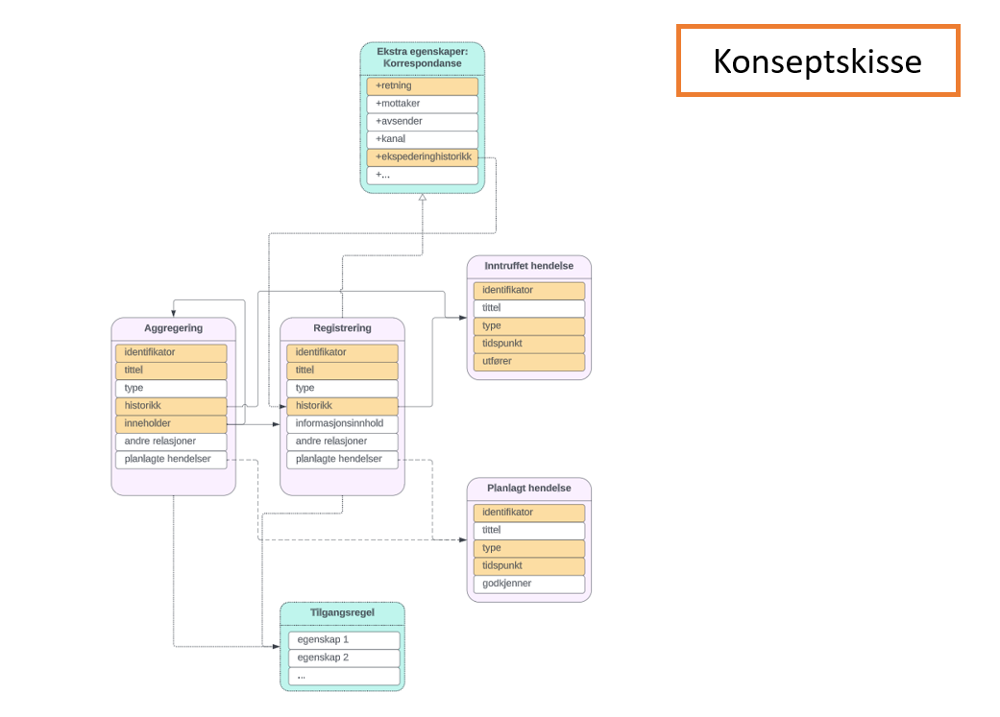

# Minimumsmodell – informasjonsmodell for dokumentasjonssystemer

> Merk: Dette er kun på hypotese-stadiet. Vesentlige endringer kan forekomme.

## Innhold i dokumentet
<!-- MarkdownTOC -->

- [Om modellen og arbeidet med den](#om-modellen-og-arbeidet-med-den)
    - [Hensikt](#hensikt)
        - [Bruksområde](#bruksomr%C3%A5de)
        - [Brukstilfeller](#brukstilfeller)
    - [Semantisk informasjonsmodell](#semantisk-informasjonsmodell)
        - [Konsekvenser / eksempler](#konsekvenser--eksempler)
    - [Hvorfor minimumsmodell?](#hvorfor-minimumsmodell)
        - [Hvordan har vi avgrenset oss?](#hvordan-har-vi-avgrenset-oss)
        - [Hvorfor har vi ikke avgrenset oss mer?](#hvorfor-har-vi-ikke-avgrenset-oss-mer)
    - [Tilnærming](#tiln%C3%A6rming)
- [Selve modellen](#selve-modellen)
    - [Klasser](#klasser)
    - [Egenskaper](#egenskaper)
        - [Registrering](#registrering)
        - [Aggregering](#aggregering)
        - [Inntruffet hendelse](#inntruffet-hendelse)
        - [Planlagt hendelse](#planlagt-hendelse)
- [Teknisk modell](#teknisk-modell)
- [Eksempler på bruk](#eksempler-p%C3%A5-bruk)
- [Spørsmål og svar](#sp%C3%B8rsm%C3%A5l-og-svar)

<!-- /MarkdownTOC -->

## Om modellen og arbeidet med den

Denne modellen er ment å være MVP for [informasjonsmodell for dokumentasjonssystemer](infomodell-api.md#informasjonsmodell-for-dokumentasjonssystemer).

### Hensikt

Minimumsmodellen er lagd for å sikre at **nødvendige** egenskaper for at objekter skal regnes som dokumentasjon (jf. krav til hva som skal sikres i [forslag til ny Arkivlov (§4)](https://www.regjeringen.no/contentassets/27ee1149002f49788beaf21e56ae7742/hoyringsnotat-5.oktober-.pdf#page=190) og grunnegenskaper for dokumentasjon) er på plass i de systemene som skal ivareta dokumentasjon og i de datasettene som skal regnes som dokumentasjon. Med grunnegenskaper mener vi autentisitet, pålitelighet, integritet og anvendbarhet - ref. ISO 15489 kap 5.2.2.

Mer konkret peker modellen på de konkrete metadataene som er **nødvendige** for at en skal kunne fastslå at egenskapene er ivaretatt.Modellen vil være et grunnsett av metadata, og som hovedregel vil den brukes sammen med ulike tillegg som er tilpasset de funksjonene og/eller de domenene en løsning eller et datasett skal dekke. 

I tillegg er modellen en angivelse av hvilke klasser av objekter som bør støttes når innholdet i et system/datasett er dokumentasjon, men den pålegger ikke et hierarki.

Modellen vil være en anbefalt standard[^1]. Det vil si at Arkivverket mener man bør ha god grunn hvis man velger å fravike den, men det vil ikke være behov for noen form for dispensasjon.

Modellen utvikles og vedlikeholdes i tråd med StandardLabs prinsipper. Dette vil si at den bygger på gjenbruk av andre standarder (ref. [tilnærming](#tilnærming)), og at den vil evalueres kontinuerlig og justeres i tråd med endringer i hva som oppleves som beste praksis.

#### Bruksområde

Modellen skal brukes i dokumentasjonssystemer som brukes i offentlig sektor.

_Dokumentasjonssystemer_ er definert som "System som forvalter dokumentasjon over tid" (jf. ISO 30300)

_Dokumentasjon_ er definert med utgangspunkt i definisjonene av _arkiv_ og _dokument_ i Arkivlova. Definisjonen blir "logisk avgrensa informasjonsmengder som vert til som lekk i ei verksemd, og som er lagra (på eit medium) for seinare lesing, lyding, framsyning eller overføring" (jf. §2 a./b.). Dette samsvarer i stor grad med definisjonen av dokumentasjon som brukes i ISO 30300 ("informasjon som en organisasjon eller person produserer, mottar og vedlikeholder som bevis og som et aktivum, som et ledd i å oppfylle rettslige forpliktelser eller i en forretningstransaksjon")

Det brede bruksområdet medfører at modellen må være et slags minste felles multiplum av metadata en kan anta at er (eller i det minste bør være) til stede i alle systemer, og at det ikke stilles flere obligatoriske krav enn nødvendig.

#### Brukstilfeller

Følgende brukerhistorier skal løses av modellen:

- Som bestiller av dokumentasjonsløsning i forvaltningen ønsker jeg at standarden stiller krav til at riktige metadata for å vise at (sentrale) faglige krav til arkiv er ivaretatt for informasjonsobjekter i løsningen når jeg skal anskaffe (utvikling av) nytt system, for å sikre at løsningen er egnet til at vi som organisasjon oppfyller våre plikter ved å bruke den
- Som leverandør av felleskomponent/fellesløsning eller dokumentasjonssystem ønsker jeg å vite hvilke metadata som kreves for å vise at (sentrale) faglige krav (f.eks. regelverk) er ivaretatt når jeg skal (videre-)utvikle datamodell(er) som brukes i mitt system, for å sikre at min løsning kan spille sammen med andre arkivløsninger

Modellen skal også bidra til følgende brukerhistorie:

- Som systemansvarlig for dokumentasjonssystem i forvaltningen / utvikler av dokumentasjonssystem / leverandør av felleskomponent ønsker jeg å oppnå/opprettholde semantisk interoperabilitet med systemer som behandler tilsvarende metadata når jeg skal (videre-)utvikle datamodell(er) som brukes i mitt system, for å sikre effektiv utveksling av dokumentasjon

### Semantisk informasjonsmodell

Modellen som lages er en informasjonsmodell på semantisk nivå. Det vil si at modellen skal dekke hvilken informasjon som må/bør være til stede i systemet/datasettet for at det skal ha verdi som dokumentasjon, uten å legge føringer for hvordan systemet/datasettet skal utformes for at nødvendig informasjon er ivaretatt. En modell på semantisk nivå er egnet til å avdekke:

- I et datasett: Vet vi nok om hvert informasonsobjekt til å fastslå at det har verdi som dokumentasjon (=er en record).
- I et datasystem: Har systemet funksjonalitet (=tar vare på de riktige metadataene) for å ivareta at innholdet er dokumentasjon.
- I utvikling av et system: Hva (=hvilke metadata) må være på plass for å sørge for at det ivaretar dokumentasjon

Samtidig er det veldig viktig for teamet ikke å miste koblingen til det tekniske nivået, siden det ofte er graden av slik kobling som skiller mellom en modell som kan brukes i praksis og og en som ikke kan det. Dette ivaretas ved at krav som ligger i grenseland mellom funksjonelt og teknisk nivå tas inn i beskrivelser av ulike egenskaper i modellen. Det er også verdt å merke seg at krav til den tekniske implementeringen kan komme som følge av pålagte grensesnitt, uttrekksformat mv.

#### Konsekvenser / eksempler

- **Fri navngiving av datafelter**  
Dersom modellen peker på at informasjonsobjekter skal ha egenskapen `tittel`, er et system eller datasett i henhold til standarden selv om det relevante feltet heter `title` eller `saksnavn` i systemet. Det viktige er at informasjonen beskrevet som `tittel` i modellen faktisk finnes for de ulike informasjonsobjektene.
- **Ikke (pålagt) en-til-en-forhold mellom egenskaper i modellen og datafelt i systemet/datasettet**  
Et system som legger `tittel` i ulike felter avhengig av typen informasjonsobjekt (f.eks. `sakstittel`, `møtetittel` og `dokumenttittel`) er i henhold til standarden så lenge det er kjent når de ulike feltene er `tittel`. Et system som har `tittel` fordelt på flere datafelter (f.eks. at tittel er "`dokumenttype` om `tema`") vil også være innenfor standarden.
- **Få/ingen krav til format**  
Dersom modellen krever at informasjonsobjekter skal ha egenskapen `identifikator` kan løpenummer, UUID og farge alle være gyldige måter å angi hva identifikatoren er, så lenge funksjonelle krav (f.eks. at identifikator skal være kontekstuelt unik) er ivaretatt.
- **«Rike» objekter og relasjoner er begge gyldige måter å håndtere modellen på**  
Det er likeverdig om kravet "informasjon om aktør som opprettet et informasjonsobjekt" er dekket ved at informasjon ligger direkte som datafeltet `oppretter` på informasjonsobjektet eller det er en henvisning til en hendelse av typen "opprettelse" i `historikk` på informasjonsobjektet, og hendelsen har datafeltet `oppretter` på seg.

### Hvorfor minimumsmodell?

Vi så tidlig at det å dekke hele behovet for å utvikle informasjonsmodell for dokumentasjonssystemer ville bli for stort til at det var egnet å løse hele behovet med en gang. Derfor tar vi i bruk en smidig tilnærming ved å levere biter som kan deles fortløpende slik at flere kan gi tilbakemelding på det vi tenker, og gi verdi fort. Samtidig får vi da bygd erfaring på å jobbe med informasjonsmodellen(e), og en bedre forståelse for totalbehovet. En mindre omfattende modell er også antatt å være enklere å vedlikeholde og tilpasse eventuelle endrede behov enn det en større modell vil være.

En slik minimumsmodell må finne riktig balanse mellom behovet for å kunne avgrense nok (slik at det ikke blir for omfattende) og behovet for å ikke avgrense for mye (slik at man lager noe som kan brukes).

#### Hvordan har vi avgrenset oss?

Grunnleggende kan man se for seg to ulike tilnærminger til hvordan man kan komme fram til en verdigivende delmengde av den fullstendige informasjonsmodellen:

- **Funksjonsbasert inndeling** – at man deler inn etter hva slags funksjonalitet som er relevant å ha informasjonsmodell for. Eksempelvis: Ivaretakelse av dokumentasjonsverdi / offentlig journal / saksflyt
- **Domenebasert inndeling** – at man deler inn etter hva slags ulike typer systemer som er relevant å ha informasjonsmodell for. Eksempelvis: Møtedokumentasjon / korrespondanse / register eller bygg / kjøretøy / helse

Vi har vurdert det til at det gir mer verdi totalt sett hvis vi legger funksjonsbasert tilnærming til grunn i første runde, og har derfor landet på en modell som ivaretar «noe» for alle dokumentasjonssystemer framfor noe som ivaretar alt for «noen» systemer.

#### Hvorfor har vi ikke avgrenset oss mer?

For en funksjonsbasert inndeling vil det være logisk at den første modellen er en grunnmodell eller minimumsmodell. Begge vil være grunnlag som beskriver et minste felles multiplum av egenskaper det må finnes metadata for, og fungerer som grunnlag for ulike utvidelser. Forskjellen på disse modellene (slik vi tolker det) er at en minimumsmodell, i motsetning til en grunnmodell, må være omfattende nok til at den er tilstrekkelig til å dekke noen brukstilfeller. Det er derfor mer verdi i en minimumsmodell enn en grunnmodell.

En konsekvens av at dette skal være en minimumsmodell, ikke en grunnmodell, er at flere egenskaper må være del av modellen. I vår minimumsmodell er dette egenskaper som er betinget obligatoriske eller sterkt anbefalte for å kunne ivareta grunnegenskapene for dokumentasjon (autentisitet, pålitelighet, integritet og anvendbarhet). Dette er også hovedargumentasjonen for at det er behov for to klasser (registering og aggregering), ikke bare én (dokumentasjonsobjekt).

### Tilnærming

- Vi starter fra grunnen med å definere metadatabehovene
- ISO 23081-2 vil benyttes som første kilde til hvilke typer metadata som er nødvendig
- For å definere konkrete metadata prøver vi ut to ulike tilnærminger[^2]
  1. Utgangspunkt i kjente metadatastandarder som er konkretiseringer av 23081-2 ([Nederlandske retninglinjer](https://www.nationaalarchief.nl/archiveren/kennisbank/metagegevens-0) og [Australsk standard](https://www.naa.gov.au/information-management/standards/australian-government-recordkeeping-metadata-standard))
  2. Faglig diskusjon rundt hvilke metadata som er **nødvendige** og relasjon til mer omfattende standarder ([CITS ERMS](https://dilcis.eu/content-types/cserms) og [Noark](https://www.arkivverket.no/forvaltning-og-utvikling/noark-standarden/noark5-standarden))
- Sammenligning og sammenslåing av resultatet fra de to tilnærmingene.

## Selve modellen

### Klasser

Som nevnt over er det to klasser for dokumentasjonsobjekter - aggregering og registrering. Sammenhengen mellom dem kan illustreres slik:

**Registrering** er et informasjonselement der informasjonsinnholdet behandles som er del av registreringen. Det er det laveste nivået i et informasjonshierarki der det er viktig å ivareta arkivfaglige verdier for. Dette innebærer at en registrering alltid har et informasjonsinnhold. Det kan likestilles med «record» i internasjonale dokumentasjonsforvaltningsstandarder. Det vil som hovedregel være dokumentasjon som skapes (mottas/innhentes/utformes/sammenstilles) som del av samme steg i et prosessforløp.
  
**Aggregering** er en samling av registreringer og/eller andre aggregeringer som det gir verdi å behandle samlet over tid. Aggregeringer har kobling(er) til andre (underliggende) objekter som sitt innhold. Aggregeringer kan brukes til å ivareta sammenheng med arbeidsprosesser generelt, de enkelte forløp av disse prosessene, hvilket objekt/organisasjon/person dokumentasjonen handler om, eller andre hierarkiske relasjoner der det er relevant. 

> Merk at aggregering ikke er en obligatorisk klasse. Den kan benyttes der en flat struktur av registreringer er mest hensiktsmessig, og vil fortsatt være kompatibelt med denne minimumsmodellen.

For både registreringer og aggregeringer har vi støtteklasser for hendelser og planlagte hendelser. Sammenhengen kan illustreres slik:

**Inntruffet hendelse** er del av endringshistorikk på den enkelte registrering eller aggregering. Det er en hendelse eller handling som har skjedd med registreringen eller aggregeringen. Eksempel er opprettelse av registrering eller aggregering.  
**Planlagt hendelse** er en hendelse eller handling som skal skje med den enkelte registrering eller aggregering. Eksempel er kassasjon av registrering eller aggregering.

For hver klasse er det definert hvilke egenskaper det skal finnes metadata for på hvert objekt av klassen:

> #### Lesehjelp
>
> **Fet:** Gjennomtenkt  
> _Kursiv:_ Tenking påbegynt  
> Asterisk (*): Obligatorisk på det enkelte objekt
>
> NB! Alt fortsatt åpent for diskusjon

### Egenskaper

#### Registrering

|**Egenskapsidentifikator**|**Tittel**|**Definisjon**|**Kommentar**|**Obligatorisk**|
| :- | :- | :- | :- | :- |
|id|Identifikator|Entydig referanse til det enkelte objekt. Den skal være unik innen kontekst (innen sin klasse i datasettet).  Relatert definisjon: http://purl.org/dc/terms/identifier|1: Det er ønskelig at identifiaktor skal være i leselig og menneskeanvendbart format. 2: Entydig identifikator er helt grunnleggende for å vite hvilken forekomst det er snakk om. At den er menneskeanvendbar er nyttig for gjenfinning.|x|
|tittel|Tittel|Kort navn som beskriver hva det enkelte objektet inneholder. Relatert definisjon: http://purl.org/dc/terms/title|Gjenfinnbarhet svekkes vesentlig hvis man ikke raskt kan få et inntrykk av hva man har funnet|x|
|type|Type|Hva slags objekt er det snakk om (eksempelvis nivå, spesialisering). Relatert definisjon: http://purl.org/dc/terms/type|Denne egenskapen burde fylles ut med kontrollert vokabular som organet definerer for det enkelte datasett.| |
|inntruffetHendelse|Hendelseshistorikk|Referanser til (eller opplisting av) de intrufne hendelsene for objektet (jf. egen klasse).  Bruk: Som minimum skal hendelsen "opprettet" være med.|1: Organet velger selv hvilke hendelser (utover opprettet) det bør registreres inntrufne hendelser for, og supplerer eventuelt med egne hendelsestyper. Standardiserte hendelsestyper skal benyttes når de er dekkende. 2: Tillit svekkes vesentlig om ikke et minimum av logging er på plass også på aggregeringsnivået|x|
|planlagtHendelse|Planlagte hendelser|Referanser til (eller opplisting av) de hendelser som er planlagt for objektet (jf. egen klasse). |1: Organet velger selv hva det bør registreres planlagte hendelser for, og supplerer eventuelt med egne hendelsestyper. De standardiserte typene skal brukes om de er dekkende. 2: Nyttig hjelpemiddel for å kunne definere planer på tvers av innholdet i en aggregering.| |
|informasjonsinnhold|Registreringen inneholder|Det som er innholdet i registreringen eller egenskaper på registreringen som beskriver innholdet (dvs. ikke det som er knyttet til dokumentasjonsforvaltningsprosessen).   Informasjonsinnholdet er dataene som er samlet, behandlet eller har oppstått som følge av forretningsaktiviteten som dokumenteres – ofte uttrykt gjennom fil(er), datastrømmer eller strukturerte data. I tillegg vil det ofte være en del egenskapsbeskrivelser ved denne som gjør den anvendbart dvs. identifiseres, presenteres, tolkes, vises/brukes. En registrering (record) kan ha flere informasjonselementer i seg.|Informasjonen skal i dette tilfellet være logisk fattbart||
|relasjon|Relasjoner|Referanse som viser sammenheng med andre aggregeringer eller registreringer, med angitt type relasjon Relatert definisjon: http://purl.org/dc/terms/relation   **Standardiserte typer** - Har etterfølger / er etterfølger av - Erstattet av / erstatter - Er grunnlag for / har grunnlag - Er referert til i / refererer til - Er relatert til|1: Denne egenskapen skal **ikke** benyttes for hierarkiske relasjoner (der aggregeringer med knyttetDokumentasjon skal benyttes) 2: Organet velger selv de relasjonstypene som er relevant for det enkelte datasett, og supplerer eventuelt med egne relasjonstyper. De standardiserte typene skal brukes om de er dekkende. 3: Historikk for relasjoner registreres som hendelser i den grad det er relevant.| |

#### Aggregering

|**Egenskapsidentifikator**|**Tittel**|**Definisjon**|**Kommentar**|**Obligatorisk**|
| :- | :- | :- | :- | :- |
|id|Identifikator|Entydig referanse til det enkelte objekt. Den skal være unik innen kontekst (innen sin klasse i datasettet).  Relatert definisjon: http://purl.org/dc/terms/identifier|1: Det er ønskelig at identifiaktor skal være i leselig og menneskeanvendbart format. 2: Entydig identifikator er helt grunnleggende for å vite hvilken forekomst det er snakk om. At den er menneskeanvendbar er nyttig for gjenfinning.|x|
|tittel|Tittel|Kort navn som beskriver hva det enkelte objektet inneholder. Relatert definisjon: http://purl.org/dc/terms/title|Gjenfinnbarhet svekkes vesentlig hvis man ikke raskt kan få et inntrykk av hva man har funnet|x|
|type|Type|Hva slags objekt er det snakk om (eksempelvis nivå, spesialisering). Relatert definisjon: http://purl.org/dc/terms/type|Denne egenskapen burde fylles ut med kontrollert vokabular som organet definerer for det enkelte datasett.| |
|inntruffetHendelse|Hendelseshistorikk|Referanser til (eller opplisting av) de intrufne hendelsene for objektet (jf. egen klasse).  Bruk: Som minimum skal hendelsen "opprettet" være med.|1: Organet velger selv hvilke hendelser (utover opprettet) det bør registreres inntrufne hendelser for, og supplerer eventuelt med egne hendelsestyper. Standardiserte hendelsestyper skal benyttes når de er dekkende. 2: Tillit svekkes vesentlig om ikke et minimum av logging er på plass også på aggregeringsnivået|x|
|planlagtHendelse|Planlagte hendelser|Referanser til (eller opplisting av) de hendelser som er planlagt for objektet (jf. egen klasse). |1: Organet velger selv hva det bør registreres planlagte hendelser for, og supplerer eventuelt med egne hendelsestyper. De standardiserte typene skal brukes om de er dekkende. 2: Nyttig hjelpemiddel for å kunne definere planer på tvers av innholdet i en aggregering.| |
|knyttetDokumentasjon|Aggregeringen inneholder|Referanser til (eller opplisting av) de registreringer eller aggregeringer som hører inn i denne aggregeringen. Relatert definisjon: http://purl.org/dc/terms/hasPart|1: Det medfører økt risiko for at krav ikke er ivaretatt når opplisting benyttes. Det bør derfor kun unntaksvis gjøres 2: Dette er innholdet for aggregeringen, tilsvarende "informasjonsinnhold" for Registreringen.|x|
|relasjon|Relasjoner|Referanse som viser sammenheng med andre aggregeringer eller registreringer, med angitt type relasjon Relatert definisjon: http://purl.org/dc/terms/relation   **Standardiserte typer** - Har etterfølger / er etterfølger av - Erstattet av / erstatter - Er grunnlag for / har grunnlag - Er referert til i / refererer til - Er relatert til|1: Denne egenskapen skal **ikke** benyttes for hierarkiske relasjoner (der aggregeringer med knyttetDokumentasjon skal benyttes) 2: Organet velger selv de relasjonstypene som er relevant for det enkelte datasett, og supplerer eventuelt med egne relasjonstyper. De standardiserte typene skal brukes om de er dekkende. 3: Historikk for relasjoner registreres som hendelser i den grad det er relevant.| |

#### Inntruffet hendelse

|**Egenskapsidentifikator**|**Tittel**|**Definisjon**|**Kommentar**|**Obligatorisk**|
| :- | :- | :- | :- | :- |
|id|Identifikator|Entydig referanse til det enkelte objekt. Den skal være unik innen kontekst (innen sin klasse i datasettet).  Relatert definisjon: http://purl.org/dc/terms/identifier| |x|
|tittel|Tittel|Kort navn som beskriver hva den enkelte hendelse innebar. Relatert definisjon: http://purl.org/dc/terms/title|Informasjonen skal være forståelig for mennesker| |
|type|Type|Hva slags hendelse inntraff.  Relatert definisjon: http://purl.org/dc/terms/type   **Standardiserte typer** - Opprettet - Lest - Endret &nbsp;&nbsp;&nbsp;- Endret metadata &nbsp;&nbsp;&nbsp;- Endret innhold &nbsp;&nbsp;&nbsp;- Endret relasjon &nbsp;&nbsp;&nbsp;- Endret planlagt hendelse - Slettet &nbsp;&nbsp;&nbsp;- Overført &nbsp;&nbsp;&nbsp;- Kassert &nbsp;&nbsp;&nbsp;- Satt til utgått - Låst - Gjenåpnet |1: Denne egenskapen burde fylles ut med kontrollert vokabular som defineres for det enkelte datasett.De standardiserte typene skal brukes om de er dekkende. 2: Endret i standardiserte typer kan innebære at noe er nytt, endret eller fjernet. 3: Merk at utvidelser kan medføre nye standardiserte typer.|x|
|tid|Tidsangivelse for hendelse|Angivelse av når en hendelse har inntruffet, enten i form av tidspunkt eller tidsperiode Relatert definisjon: http://purl.org/dc/terms/created| |x|
|utfører|Utfører av hendelse|Aktør[^3] som har utført denne hendelsen. Realtert definisjon: http://purl.org/dc/terms/creator| |x|

#### Planlagt hendelse

|**Egenskapsidentifikator**|**Tittel**|**Definisjon**|**Kommentar**|**Obligatorisk**|
| :- | :- | :- | :- | :- |
|id|Identifikator|Entydig referanse til det enkelte objekt. Den skal være unik innen kontekst (innen sin klasse i datasettet).  Relatert definisjon: http://purl.org/dc/terms/identifier| |x|
|tittel|Tittel|Kort navn som beskriver hva den enkelte hendelse innebar. Relatert definisjon: http://purl.org/dc/terms/title|Informasjonen skal være forståelig for mennesker| |
|type|Type|Hva slags hendelse er planlagt.  Relatert definisjon: http://purl.org/dc/terms/type   **Standardiserte typer** - Kassasjon - Overføring -Endring av innhold|1: Denne egenskapen burde fylles ut med kontrollert vokabular som defineres for det enkelte datasett.De standardiserte typene skal brukes om de er dekkende. 2: Planlagt endring av innhold kan være relevant for eksempel i forbindelse med formatvedlikehold. 3: Merk at utvidelser kan medføre nye standardiserte typer|x|
|tid|Tidspunktet for hendelse|Tidspunkt for når en hendelse skal skje. Kan også være en tidsperiode i tilfelle hendelsen kommer å være lenge nok. Kan også være beskrivele av utløser for hendelsen.| |x|
|oppretter|Oppretter av hendelse|Aktør[^3] som har opprettet den planlagte hendelsen.| | |

## Konsept: Minimumsmodell med utvidelsesmoduler

Minimumsmodellen tar vare på grunnleggende metadata om dokumentasjonen. I de fleste tilfeller vil det også være andre metadata som er relevant å ta vare på. Der disse metadataene er felles på tvers av flere aktører og systemer, vil det være relevant å lage en tilleggsmodul til minimumsmodellen for å dekke det relevante domenet/formålet.​

Innholdet i en slik tilleggsmodul vil kunne være flere klasser av informasjonsobjekter, flere egenskaper det skal finnes metadata for, eller regler for hvordan eksisterende klasser og egenskaper skal brukes innen et domene (for eksempel standardiserte typer registreringer og aggregeringer). ​

> Merk at tilleggsmodulene ikke nødvendigvis trenger komme fra Arkivverket.​

Eksempler på slike tilleggsmoduler kan være for eksempel tilgangsbestemmelser på informasjonsobjektnivå, korrespondansemetadata, metadata fra dokumentflyt og metadata innenfor domenet barnevern. Hvilke tilleggsmoduler som er relevant må vurderes utfra hva slags datasett/system det er snakk om, og når det er relevant kan flere tilleggsmoduler brukes i parallell som vist i figuren under.

Det er også åpent for at det lages lokale utvidelser på toppen av minimumsmodellen og tilleggsmodulene. Det vil i så fall være en forutsetning at det ved overføring også følger med informasjon om hva disse lokale utvidelsene inneholder og hvordan de skal tolkes.​

## Teknisk modell

Tekniske modeller er viktige for både å kunne oppnå interoperabilitet mellom løsninger som tar var på dokumentasjon og vise modellene på en måte som engasjerer mer teknisk publikum. Samtidig skal ikke de tekniske modellene normeres på like bestemt nivå som den semantiske modellen. Teknisk modell skal heller være veiledning på hvordan det er mulig å ta den semantiske modellen i bruk for å løse sine oppgaver.
Derfor samles de illustrasjonene for mulige tekniske modeller i egen fil: [tekniske-modeller.md](tekniske-modeller.md)

## Eksempler på bruk

Eksempler av bruk samles på egen side: [infomodell-eksempler.md](infomodell-eksempler.md)

Det er følgende eksempler som er utarbeidet i dag:
* **Bompenger**: Hvordan kan minimumsmodell brukes for å ta vare på dokumentasjon i fagløsning som registrer passeringer av bom og fakturere basert på det?
* **Sensordata**: Hvordan minimumsmodellen kan brukes for å ta vare på dokumentasjon i løsningen som samler data om vannstand i magasiner i sanntid
* **Skriftlig eksamen**: Hvordan hjelper minumummodellen for å ta vare på dokumentasjon i løsningen som brukes for å avlegge skriftlig eksamen på skolen
* **Anskaffelse**: Hvordan kan minimumsmodell hjelpe når virksomhet går til anskaffelse av en ny løsning
* **Leverandør**: Hvordan minimumsmodell kan hjelpe leverandør av løsningen for å sikre sine kunder at løsningen tar vare på dokumentasjon på riktig måte

## Spørsmål og svar

**Kommer denne informasjonsmodellen til å basere seg på ontologier og RDF?**  
Dette er ikke noe vi har tatt stilling til ennå. Om du har innspill, sjekk gjerne [issue 76](https://github.com/arkivverket/standardlab/issues/76)

**Er det en målsetning at modellen skal dekke det som i dag er klassiske Noark 5- og fagsystem-innhold?**  
Ja. Modellen skal være relevant for alle system som inneholder dokumentasjon der det er relevant å ivareta grunnegenskapene, jf. [hensiktsbeskrivelsen](#hensikt).

**Har dere tenkt å teste det ut på ulike typer dokumentasjon?**  
Testene for modellen er ennå ikke definert ennå, men når vi lager eksempler og tester vil det være logisk å favne bredt.

**Angående RDF har dere sett på RIC CM?**  
_Records in Context - Conceptual model_ er en modell vi er klar over at finnes, men ikke har tatt stilling til hvordan vi skal forholde oss til.

**Slik dere definerer dokumentasjon vil også registre f.eks. Folkeregisteret og Matrikkelen være inkludert. Hva tenker dere er aggrergeringsnivå i den typen dokumentasjonssystemer?**  
Det er opp til eieren av et system eller datasett å finne ut hvilke aggregeringer som gir verdi for deres informasjon. For matrikkelen kan f.eks. dokumentasjon per kommune være en mulig aggregering. Merk også at det ikke (så langt) er pålagt at man skal benytte både registrerings- og aggregeringsnivået for at man skal være kompatibel med denne modellen. Dersom en flat struktur med registreringer er mest relevant, er det også en gyldig måte å organisere dokumentasjonen.

**Når modellen er på semantisk nivå - hvordan sikrer dere da at tittel som begrep forstås i langtidbevaringen, når feltnavnet bevart kan være 1000 ulike?**  
Den semantiske modellen i seg selv er ikke lagd for å sikre dette. Det er derfor vi nevner i siste avsnitt av [semantisk informasjonsmodell](#semantisk-informasjonsmodell) at krav til teknisk implementasjon vil være relevant i forbindelse med utveksling, uttrekk og kanskje andre prosesser.

**Vil det finnes et overordnet metadata-katalog, ala et utvidet Noark 5-sett der alle mulige felttyper eller entiteter som vi ofte kaller det, blir unikt forklart hva er?**  
Minimumsmodellen vil kompletteres med forklaring av de ulike egenskapene som er del av modellen. Men siden informasjonen i systemene vil være så ulik, vil en metadata-katalog aldri kunne bli komplett. Når det er sagt, er det nok enkelte egenskaper som går igjen i flere systemer/prosesser som det kan være relevant å beskrive. Hvor mange av disse som vil defineres av StandardLab/Arkivverket er ikke besluttet ennå.

**Vil Noark bestå i parallell med denne minimumsmodellen?**  
Arkivverket har besluttet at Noark ikke skal videreutvikles. StandardLabs mandat er å jobbe med ny standardisering uavhengig av når/om (og eventuelt hvordan) Noark avvikles. Minimumsmodellen vil ikke være til hinder for at systemer bygget på Noark metadatamodell vil kunne brukes videre uten endringer, men siden kravene her er mindre omfattende, vil det åpne for at også andre løsninger kan brukes.

**Hvordan vil kvalitetssikring av etterlevelse og godkjenning skje for denne modellen?**  
Dette er et viktig spørsmål, som vi ikke har funnet svaret på ennå, men vil måtte finne ut av før vi gjør normering. Vi tar gjerne imot tanker og innspill i [issue #82](https://github.com/arkivverket/standardlab/issues/82).

[^1]: Dette vil bli formelt besluttet på et senere tidspunkt, og er arbeidshypotesen vi har jobbet ut fra.
[^2]: Tabell som viser sammenhengen mellom egenskapene i vår modell og de standardene vi har brukt som referanse vil bli lagt til som vedlegg til modellen
[^3]: Med aktør mener vi person, organisasjon eller system som innehar en rolle som starter, utfører, eller inngår i aktiviteter, jf. [Bergen kommunes oversettelse av TOGAF](https://data.norge.no/concepts/a91187c6-2ead-3da9-aba4-083885a8f03e) - se også [TOGAFs egen definisjon](https://pubs.opengroup.org/togaf-standard/introduction/chap04.html#tag_04_02)