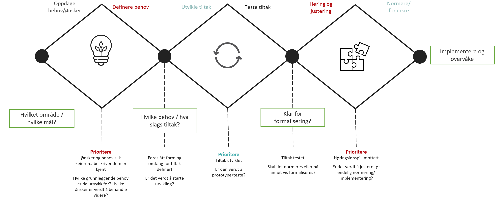

# Hvordan jobber vi?

StandardLab har en utforskende tilnærming til hvordan vi utvikler framtidens standarder for dokumentasjonsforvaltning og arkiv. Vi skal dekke hele prosessen fra å identifisere behov til et tiltak er satt i verk og vi overvåker hvor godt det fungerer. Tilnærmingen kan illustreres ved å bruke en "trippel diamant"-figur:

Utgangspunktet er at det er besluttet hvilket område (arkiv og dokumentasjonsforvaltning) og hvilke mål (jf. [Mål og prinsipper](maal-og-prinsipper.md)) vi skal løse. Deretter vil det skje arbeid i tre faser:

## Fase 1: Behov

I denne fasen gjør vi først innhenting av behov - både aktivt i form av intervjuer med relevante interessenter, og passivt ved at alle kan [melde inn behov her på GitHub](https://github.com/arkivverket/standardlab/issues/new?assignees=&labels=behov&template=behov.yml). I tillegg registrerer vi behov vi har sett selv som følge av hvordan situasjonen for standardisering er.

Deretter gjør vi arbeid for å sikre at behovet er tilstrekkelig beskrevet for å kunne vurderes. Vi gjør jevnlige vurderinger av hvilke behov vi skal jobbe aktivt med. Dette skjer etter [fastsatte prioriteringskriterier](prioriteringskriterier.md), og vi deler [resultatene](veikart.md) fortløpende. Det gjøres nye vurderinger av de ulike behovene for hver prioriteringsrunde, fordi forståelsen av behovene vil utvikles over tid.

## Fase 2: Utvikling

I denne fasen gjør vi først vurderinger av hvilke relevante kilder til gjenbruk som finnes som kan være nyttige for å løse behovet, og hvordan de kan brukes. Vi tydeliggjør hvilke vurderingskriterier vi skal legge til grunn for å si at behovet er dekket, og lager hypotese(r) til hvordan behovet kan løses. Resultatet av arbeidet blir delt fortløpende, enten som oppdateringer av behovsbeskrivelsen eller som kladder og utkast til standarder.

Når en løsningshypotese er tilstrekkelig detaljert, gjør vi testing av om den er egnet til å løse behovet. Dersom dette ikke er tilfellet går behovet tilbake til utvikling, enten for å forbedre kvaliteten på det vi har utviklet eller for å teste ut en ny hypotese. Dersom vi ser at vi ikke kommer noen vei kan vi også legge et behov på is, og ta fatt på et annet behov. I disse testene vil vi inkludere folk fra utenfor teamet.

## Fase 3: Normering

Når vi har utviklet et tiltak, vil vi gjennomføre mer formelle høringsrunder, som kan medføre justeringer på det endelige resultatet. Når høring er gjennomført vil det også gjøres en beslutning, og forankres hvordan den nye standarden skal innføres.

## Kontinuerlig forbedring

Etterhvert som vi gjør oss erfaringer med måten vi jobber på, vil vi justere den for å kontinuerlig forbedre oss. Fasene i denne beskrivelsen vil være konstante, men innholdet i dem (både hvilke aktiviteter vi gjør, og hvordan vi utfører den enkelte aktivitet) vil justeres.
